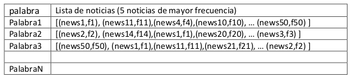

# Tópicos Especiales en Telemática Proyecto 3: Bigdata, Spark

- Douglas Ardila Garcés dardila5@eafit.edu.co
- Andrés Felipe Avendaño aavenda1@eafit.edu.co
- Felipe Macías Herrera fmacias1@eafit.edu.co

## Ambiente de ejecución
El proyecto se debe ejecutar en un cluster de Databricks Community
#### Notebook: [ver](https://databricks-prod-cloudfront.cloud.databricks.com/public/4027ec902e239c93eaaa8714f173bcfc/4324748683792239/1607293699539435/8664231812763542/latest.html)

## Metodologia: CRISP-DM

## Cross Industry Standard Process for Data Mining

        

CRISP-DM divide el proceso de minería de datos en seis fases principales.

Las flechas en el diagrama indican las dependencias más importantes y frecuentes entre fases. El círculo exterior en el diagrama simboliza la naturaleza cíclica de la minería de datos en sí. Un proceso de minería de datos continúa después del despliegue de una solución. Las lecciones aprendidas durante el proceso pueden provocar nuevas preguntas de negocio, a menudo más centradas y posteriores procesos de minería de datos se beneficiarán de la experiencia de los anteriores.

### Fases

1.  Entendimiento del negocio
  * Entender los requisitos y objetivos del proyecto.
  * Definición del problema de minería de datos.
  
2.  Entendimiento de los datos
  * Adquisición del dataset.
  * Exploración del dataset.
  
3.  Identificar las características de calidad de los datos.
  * Elección de los datos.
  * Preparación de los datos.
  * Limpieza de los datos.
  
4.  Modelado
  * Implementación en herramientas de Data Mining.

5.  Evaluación
  * Determinar si los resultados cumplen los objetivos del proyecto.
  * Identificar los temas que deben de ser cubiertos por el proyecto.
  
6.  Despliegue
  * Instalar el modelo.

### Entendimiento del negocio
La minería o analítica de texto, son un conjunto de modelos, técnicas, algoritmos y tecnologías que permiten procesar texto de naturaleza NO ESTRUCTURADA.

La minería de texto (text mining) permite transformar el texto en una forma estructurada, de tal forma que facilite una serie de aplicaciones como Búsqueda en texto, relevancia de documentos, entendimiento natural del lenguaje (NLP), traducción automática entre idiomas, análisis de sentimientos, detección de tópicos entre muchas otras aplicaciones.

Quizás el procesamiento más sencillo de todos, sea el wordcount, el cual consiste en determinar la frecuencia de la palabra por documento o por todo el dataset.

### Comprensión de los datos
El dataset comprende tres archivos CSV, compuestos por diversos artículos de diferentes periódicos y websites entre 2015 y 2016. Para cada artículo se tienen id, titulo, contenido, autor, url y fecha de publicación.

## Preparación de datos
Se trabajó sobre el dataset [all-the-news](https://www.kaggle.com/snapcrack/all-the-news), el cual contiene 143000 noticias. 
Primero, se realizó la preparación de los datos a través del siguiente pre-procesamiento:
1. Se borraron todos los caracteres especiales (. , % ( ) ‘ “ ...., mediante la expresión regular: '[^0-9a-zA-Z]+'
2. Se borraron todas las stopwords haciendo uso de [StopWordsRemover](https://spark.apache.org/docs/2.2.0/ml-features.html#stopwordsremover) de Spark.
3. Se borraron todas las palabras de longitud 1 mediante la expresión regular: '(?:^| )\w(?:$| )'

## Búsqueda en índice invertido
Un índice invertido es un mecanismo orientado a palabras para indexación de documentos. El propósito de un índice invertido es permitir la rápida búsqueda en un texto completo, a un costo de procesamiento mayor cuando un documento se agrega a la base de datos.
El índice invertido tendrá la frecuencia de cada palabra en el titulo+descripción.

Donde por cada palabra que se ingrese por teclado en el Notebook, se liste en orden descendente por frecuencia de palabra en el contenido de la noticia, las noticias más relevantes.
El Índice invertido es una estructura de datos que contiene la siguiente estructura:

## Agrupamiento de noticias

El agrupamiento de noticias permite a cualquier noticia identificar que otras noticias son similares.

